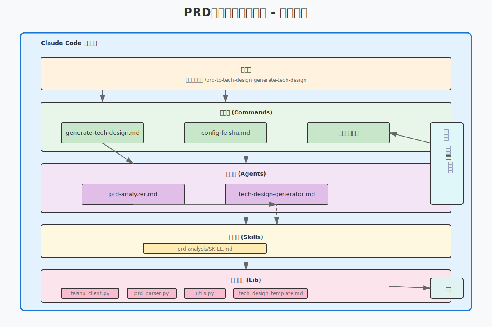
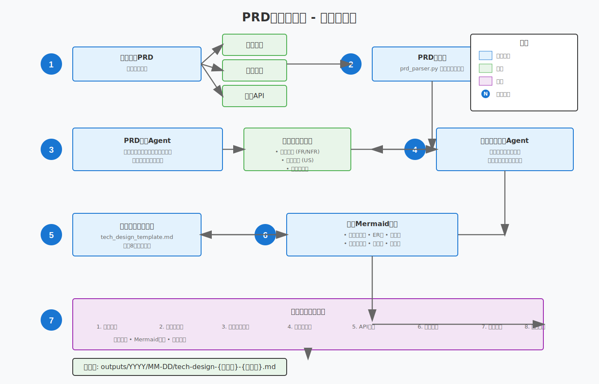
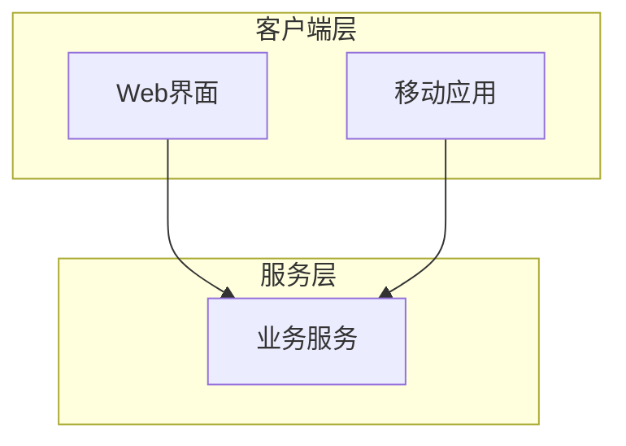
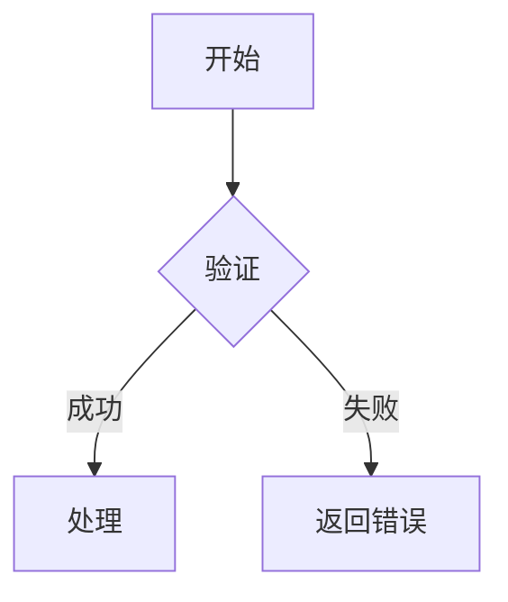
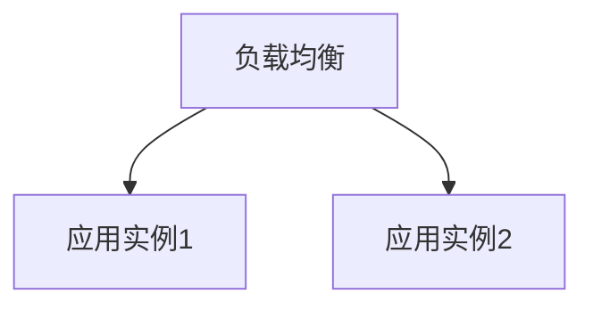

# PRD转技术方案生成器

一个Claude Code插件，可以将产品需求文档（PRD）转换为完整的技术设计文档。

## 功能特性

- **多种输入来源**：
  - 本地Markdown文件
  - 飞书导出内容
  - 飞书API直接获取

- **完整的输出内容**：
  - 功能概述
  - 技术栈选型
  - 核心模块设计（**包含架构图**）
  - 数据库设计（**包含ER图**）
  - API设计
  - 部署架构（**包含部署图**）
  - 风险评估
  - 开发计划（**包含甘特图**）

- **智能分析**：
  - PRD解析和需求提取
  - 自动识别技术影响
  - 生成结构化输出

- **丰富的图表**：
  - 使用Mermaid语法绘制
  - 系统架构图
  - 核心流程图
  - 数据库ER图
  - 部署架构图
  - CI/CD流程图
  - 项目时间线甘特图

## 架构图

### 插件整体架构



### 数据流程



### 组件交互


更多架构图说明请查看 [docs/README.md](./docs/README.md)

## 🚀 快速开始

**第一次使用？** 查看 [QUICKSTART.md](./QUICKSTART.md) 快速上手！

### 1. 安装依赖

```bash
cd prd-to-tech-design
pip install -r requirements.txt
```

### 2. 验证安装

```bash
./scripts/test-plugin.sh
```

### 3. 启动插件

```bash
claude --plugin-dir ./
```

### 4. 生成技术方案

在Claude Code中运行：

```
> /prd-to-tech-design:generate-tech-design
```

选择输入方式并按提示操作即可！

📖 **详细使用指南**：[docs/USAGE.md](./docs/USAGE.md)

## 📚 文档导航

- [QUICKSTART.md](./QUICKSTART.md) - 新手快速开始（5分钟上手）
- [docs/USAGE.md](./docs/USAGE.md) - 完整使用指南
- [docs/README.md](./docs/README.md) - 架构图说明
- [examples/sample-prd.md](./examples/sample-prd.md) - 示例PRD

1. 安装Python依赖：
```bash
pip install -r requirements.txt
```

2. 配置飞书API（可选，用于直接获取文档）：
```bash
./scripts/setup_feishu.sh
```

3. 测试插件：
```bash
claude --plugin-dir ./prd-to-tech-design
```

## 使用方法

### 从本地文件生成技术方案

```
> /prd-to-tech-design:generate-tech-design
您想如何提供PRD？ > 本地文件
请提供文件路径： > ./my-prd.md
```

### 从飞书导出内容生成

```
> /prd-to-tech-design:generate-tech-design
您想如何提供PRD？ > 飞书导出内容
请粘贴markdown内容： > [粘贴内容]
```

### 从飞书文档ID生成

```
> /prd-to-tech-design:generate-tech-design
您想如何提供PRD？ > 飞书文档ID
请提供文档ID： > docx_xxxxxxxxx
```

## 配置

### 飞书API设置

1. 在 https://open.feishu.cn/app 创建飞书应用
2. 获取app_id和app_secret
3. 使用以下命令配置：
```
> /prd-to-tech-design:config-feishu
```

或手动创建 `config/feishu_config.json`：

```json
{
  "app_id": "your_app_id",
  "app_secret": "your_app_secret"
}
```

## 输出

技术设计文档保存到：
```
outputs/YYYY/MM-DD/tech-design-{功能名称}-{时间戳}.md
```

## 生成的图表示例

插件会自动生成以下类型的Mermaid图表：

### 1. 系统架构图


### 2. 核心流程图


### 3. 数据库ER图


### 4. 部署架构图


### 5. 项目甘特图


## 架构

- **Commands**：面向用户的斜杠命令
- **Agents**：专门的分析和生成子代理
- **Skills**：可复用的PRD分析能力
- **Lib**：飞书集成和解析的Python工具

## 开发

### 运行测试

```bash
pytest tests/
```

### 代码格式化

```bash
black lib/
flake8 lib/
```

## 项目结构

```
prd-to-tech-design/
├── .claude-plugin/         # 插件清单
├── commands/               # 斜杠命令
├── agents/                 # 子代理
├── skills/                 # 可复用技能
├── lib/                    # Python工具库
├── scripts/                # 辅助脚本
├── config/                 # 配置文件
├── outputs/                # 生成的文档
└── tests/                  # 测试套件
```

## 贡献

欢迎贡献！请随时提交问题或拉取请求。

## 许可证

MIT许可证

## 参考资料

- [Claude Code插件文档](https://claudecn.com/en/docs/claude-code/plugins/create-plugins/)
- [飞书API文档](https://open.feishu.cn/document/)
